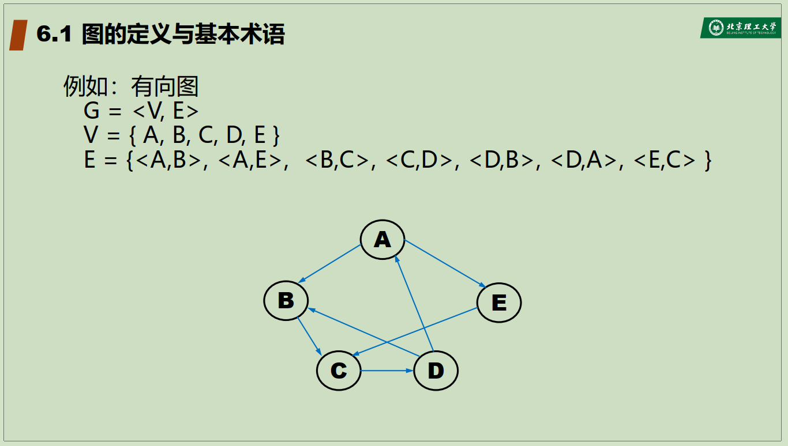
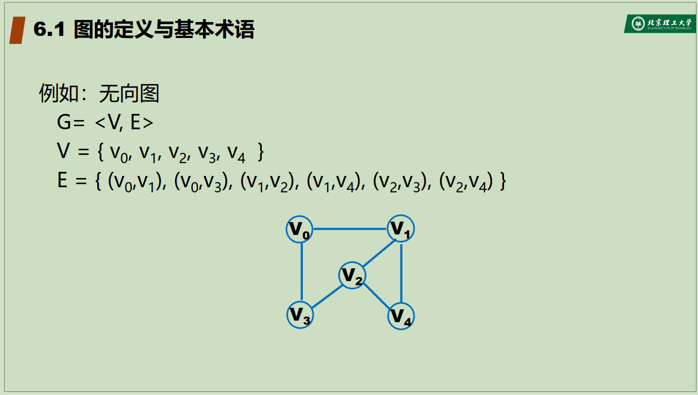
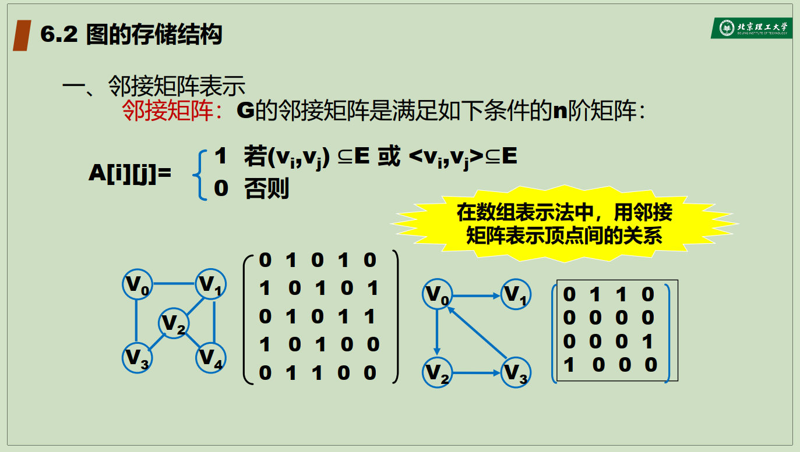
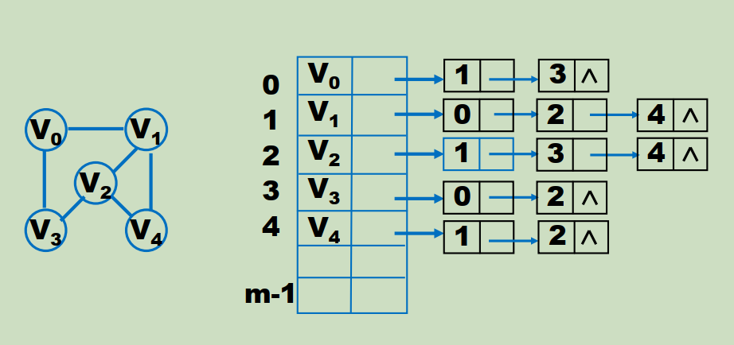
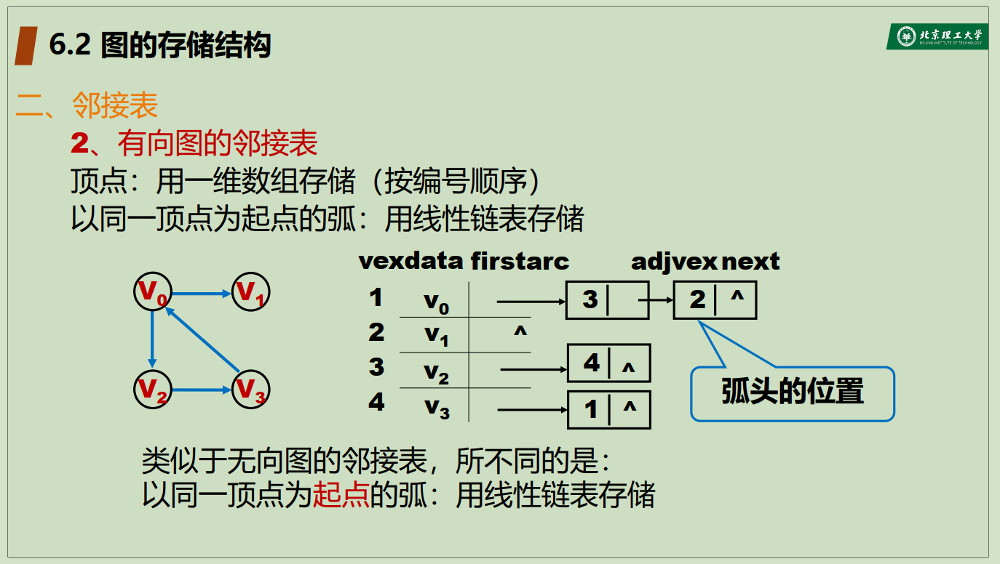
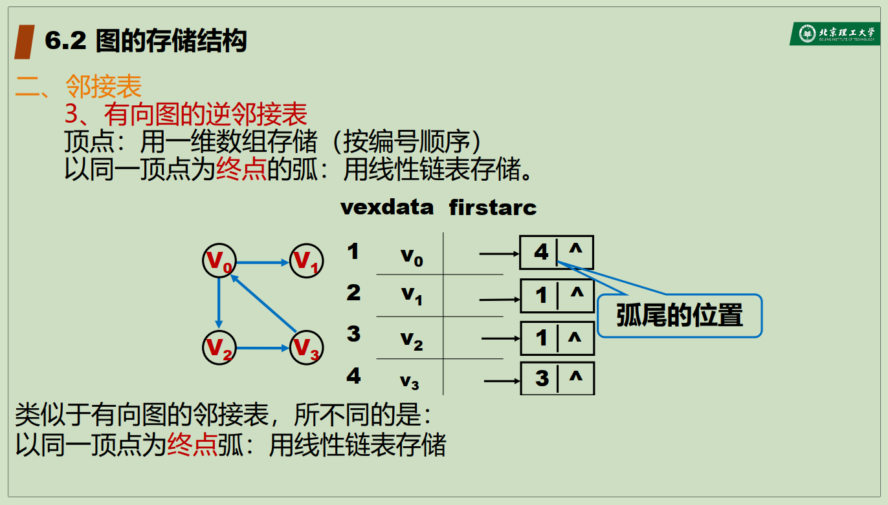
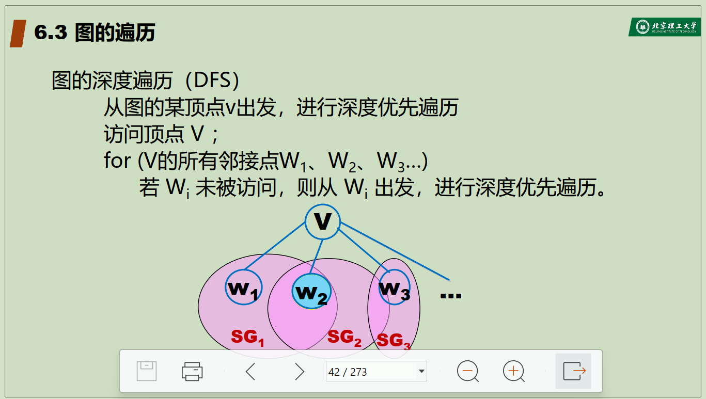
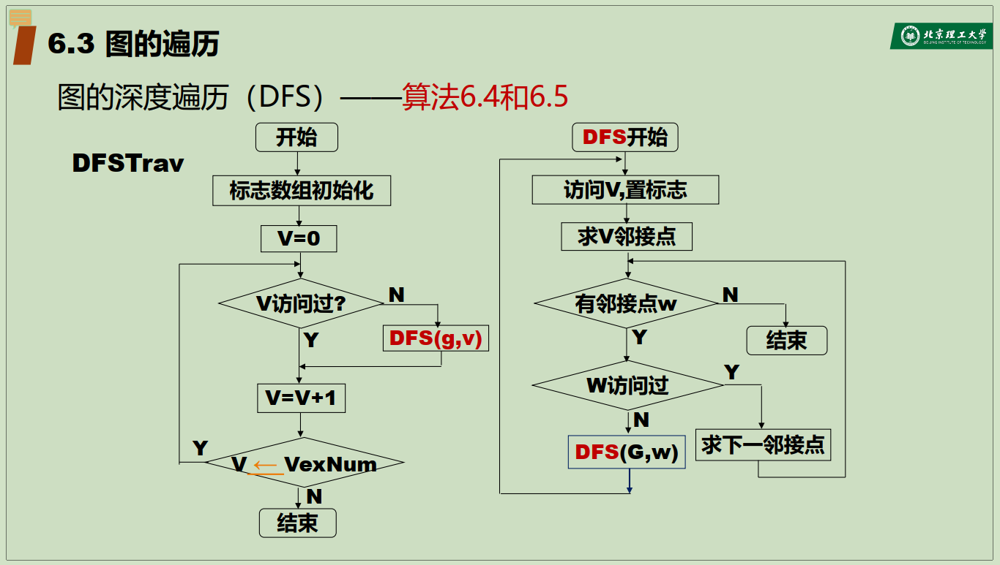
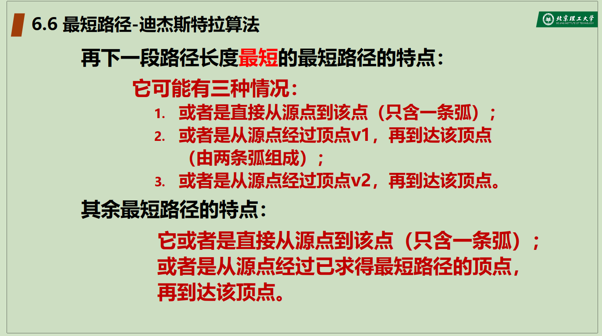

# 图

## 1. 图的定义与基本术语

### 1.1 图的定义

图是由两个集合V和E组成的，记为G=(V,E)。其中，V是顶点的有穷非空集合；E是V中顶点偶对的有穷集合，边是顶点的无序对或有序对，称为边的集合。

**有向图**

有向图G=(V,E)是指图中边是有方向的，即每条边都是有向边。

    其中，V是顶点的有穷非空集合；E是V中顶点偶对的有穷集合，边是顶点的有序对，记为<v,w>，v是弧尾,w是弧头，称为边的集合。

例如，


**无向图**

无向图G=(V,E)是指图中边是无方向的，即每条边都是无向边。

    其中，V是顶点的有穷非空集合；E是V中顶点偶对的有穷集合，边是顶点的无序对，记为(v,w)，v和w是顶点，并且（v,w）=(w,v),称为边的集合。

例如，


**完全图和稀疏图**

假定图中有n个顶点，e是边的数量，那么

- 无向完全图：e=n(n-1)/2

- 有向完全图：e=n(n-1)

- 若e<n log n，则称该图为稀疏图。否则，称该图为稠密图。

### 1.2 图的基本术语

- 邻接点：如果两个顶点之间有边，则称这两个顶点为邻接点。

- 关联边：若e=(v,u),则称e为顶点v和顶点u关联的边。

- 度：顶点v的度是指与顶点v关联的边的数量。

- 入度：顶点v的入度是指以顶点v为头的边的数量。

- 出度：顶点v的出度是指以顶点v为尾的边的数量。

- 图的所有顶点的度之和等于2^e，e是边数。

- 路径、回路：

    无向图G=(V,E)中，从顶点v到顶点u的路径是指一个顶点序列v=v0,v1,v2,...,vn=u，其中vi和vi+1是邻接点，则称该序列为从v到u的路径。若v=u，则称该路径为回路或环。

    有向图G=(V,E)中，从顶点v到顶点u的路径是指一个顶点序列v=v0,v1,v2,...,vn=u，其中vi和vi+1是邻接点，则称该序列为从v到u的路径。若v=u，则称该路径为回路或环。

    路径的边数称为路径的长度。    

- 连通图

在无向图G=(V,E)中，如果对于任意两个顶点v和u，都存在从v到u的路径，则称该图为连通图。

- 强连通图

在有向图G=(V,E)中，如果对于任意两个顶点v和u，都存在从v到u的路径和从u到v的路径，则称该图为强连通图。

- 子图

    设G=(V,E)和G'=(V',E')，如果V'是V的子集，E'是E的子集，则称G'是G的子图。

- 连通子图

    设G=(V,E)和G'=(V',E')，如果V'是V的子集，E'是E的子集，且G'是连通图，则称G'是G的连通子图。

- 极小联通子图

    设G=(V,E)和G'=(V',E')，如果V'是V的子集，E'是E的子集，且G'是连通图，且G'的任何一个顶点都不在G'的任何一个顶点的子图中，则称G'是G的极小连通子图。即，该子图删掉任何一条边，子图不再联通

- 极大强连通子图

    设G=(V,E)和G'=(V',E')，如果V'是V的子集，E'是E的子集，且G'是强连通图，且G'的任何一个顶点都不在G'的任何一个顶点的子图中，则称G'是G的极大强连通子图。

- 生成树

    包含无向图的所有顶点的极小连通子图。

### 1.3 图的存储结构

#### 1.3.1 邻接矩阵

G=(V,E)的邻接矩阵是一个二维数组A，其中A[i][j]表示顶点i和顶点j之间的边的权值。



邻接矩阵，可考虑分别存储两个矩阵，一个矩阵用于存顶点的信息，一个矩阵用于存边的信息。

```c++

#define INF 65535
#define MAX_VERTEX_NUM 20

typedef enum{DG,DN,UDG,UDN}GraphKind;

//弧矩阵
typedef struct ArcCell {
    VEType adj; //顶点类型，对于无权图，用1或0表示是否相邻；对于带权图，用权值表示权值
    InfoType *info;//该弧相关信息的指针
}ArcCell,AdjMatrix[MAX_VERTEX_NUM][MAX_VERTEX_NUM];

typedef struct {
    VertexType vexs[MAX_VERTEX_NUM]; //顶点向量
    AdjMatrix arcs; //邻接矩阵
    int vexnum,arcnum;  //图的当前顶点数和弧数
    GraphKind kind; //图的种类标志
}MGraph;

```

#### 1.3.2 邻接表

**无向图**

- 顶点：通常按编号顺序将顶点数据存储在一维数组中

- 关联同一顶点的边：用线性链表存储



```cpp

typedef struct ArcNode {
    int adjvex;
    struct ArcNode *nextarc;
}ArcNode;

typedef struct tnode {
    int vexdata;
    ArcNode *firstarc;
}VNode,AdjList[MAX_VERTEX_NUM];

typedef struct {
    AdjList vertices;
    int vexnum,arcnum;
    int kind;
}Graph;

typedef enum {DG,DN,UDG,UDN}GraphKind;
```

**有向图**

- 顶点：通常按编号顺序将顶点数据存储在一维数组中

- 关联同一顶点的边：用线性链表存储





```cpp
//有向图的十字链表表示法

//弧结点
typedef struct ArcBox {
    int tailvex,headvex;
    struct Arc
}

```

## 2. 图的遍历

### 2.1 图的深度优先遍历DFS



由于没有规定访问邻接点的顺序，所以深度优先序列不唯一。



递归算法

```cpp
void DFSTrav (Graph G, void (*Visit)（VertexType e)）{
    for(int v=0; v<G.vexnum; v++){
        visited[v]=FALSE;
    }
    for(int v=0; v<G.vexnum; v++){
        if(!visited[v]){
            DFS(G,v);
        }
    }
}//DFSTrav

void DFS(Graph G, int v, void (*Visit)（VertexType e), int visited[]){
    Visit(v);
    visited[v]=TRUE;
    for(w=FirstAdjVex(G,v); w>=0; w=NextNeighbor(G,v,w)){
        if(!visited[w]){
            DFS(G,w,Visit(w),visited);
        }
    }
}//DFS
```

时间复杂度为O(n^2)


## 最短路径

问题模型：

- 顶点：城市

- 边：城市之间的公路

- 边的权：城市之间的距离

问题：

- 求从城市A到城市B的最短路径

### 无权图的最小路径

#### Dijkstra算法

求从某个顶点到其余各顶点的最短路径，指的是对已知图G=(V,E)，求从源点s到其余各顶点的最短路径。

##### 基本思想





- 初始：

    - 集合S存放已找到最短路径的顶点，初始时S中只有源点s

    - 集合V-S存放未找到最短路径的顶点，初始时V-S中只有源点s

    - 设源点s到其余各顶点的最短路径长度初始时为∞，到源点s的最短路径长度为0

- 第i次迭代：

    - 从V-S中选择一个顶点u，使得源点s到u的最短路径长度最小，将u加入集合S中

    - 更新源点s到V-S中所有顶点的最短路径长度

    - 重复上述步骤，直到V-S为空

##### 算法示例

```cpp

void Dijkstra(Graph &G, int v, Weight dist[], int path[]) {
    int S[MAX_VERTEX_NUM];
    int n = G.vexnum;
    for(int i=0; i<n; i++) {
        dist[i] = G.arcs[v][i];
        S[i] = 0;
        if (dist[i] < MAX_WEIGHT) {
            path[i] = v;
        } else {
            path[i] = -1;
        }
    }

    for
}


- 初始化：

#### Floyd算法

求每一对顶点之间的最短路径，指的是对已知图G=(V,E)，求每一对顶点之间的最短路径。