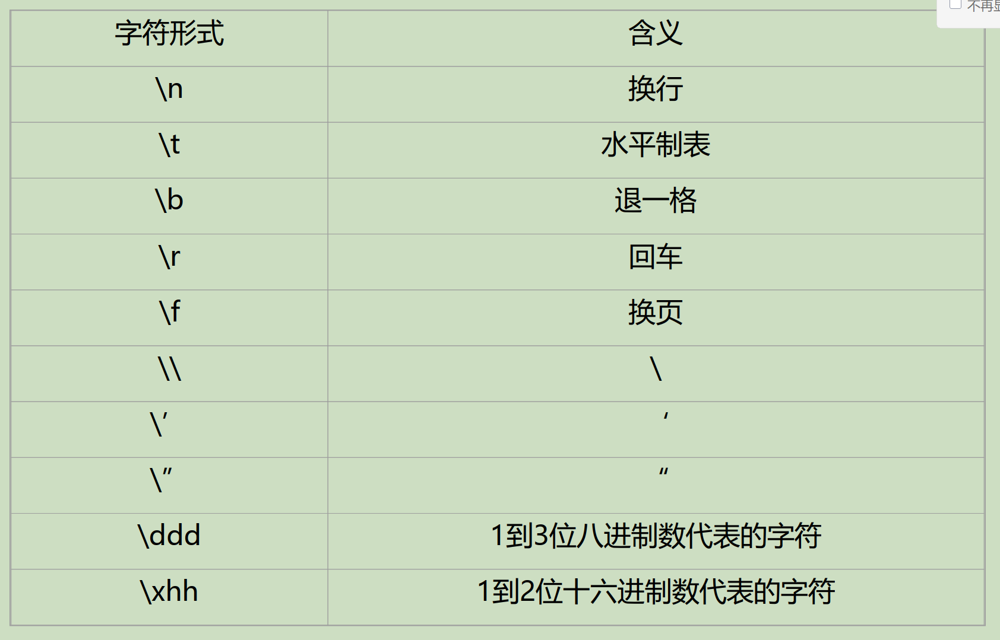

# C++基本知识

## 1. 基本

- 编译: 将高级语言的程序翻译成机器语言

    - 解释执行: 边解释边执行

    - 编译执行: 先编译再执行

- 链接: 将多个目标文件链接成一个可执行文件

- 加载: 将可执行文件加载到内存中

- 调试

- 程序的基本结构

    - 注释

    - 编译预处理指令

    - 使用命名空间

    - 主程序

- 编译预处理:处理#的指令

- 库包含的格式

    - 库是预先做好的一些工具程序

    - 每个库要提供一个接口,告诉库的用户如何使用库提供的功能

    - 库包含就是把库的接口文件放入源文件,以便编译器检查程序中对库的调用是否正确

    #include <> 系统库
    
    #include "" 用户库

- 名字空间:

    - 在大型的程序中,每个源文件可能有相同的名字
    
    - 名字空间可以将名字封装在一个名字空间中,这样就可以避免名字冲突

    - 名字空间的使用:名字空间名::名字

    - 使用名字空间的指令:using namespace 名字空间名;

## 2. 数据类型

### 2.1 自动类型推断

- auto:自动推断变量的类型并且需要赋初值

```c++
auto 变量名 = 初值;
```

它会忽略表达式的引用和const/volatile修饰符

- decltype:推断表达式的类型

```c++
decltype(表达式) 变量名;
```

### 2.2 重新命名类型名

- typedef:重新命名类型名

```c++
typedef 类型名 新类型名;
```

- using:重新命名类型名

```c++
using 新类型名 = 类型名;
```

### 2.3 占用的内存量

- sizeof:占用的内存量

```c++
sizeof(类型名);
sizeof(表达式);
```

### 2.4 转义字符



### 2.5 常量

- const:常量

```c++
const 类型名 常量名 = 初值;
```

符号常量的初值可以是一个变量或表达式的结果。

合法：

```cpp
int a;
cin >> a;
const int x = 2*a;
```

常量表达式的初值必须是编译时可以确定的。

合法：

```cpp
constexpr int x = 2;
```

非法：
```cpp
int a;
cin >> a;
constexpr int x = 2*a;
```

### 2.6 类型转换


- 强制类型转换

```cpp
类型名 (表达式);
```

- static_cast:静态类型转换
static_cast<类型名>(表达式);：这是C++风格的静态类型转换。它用于在相关类型之间进行转换，例如整型和浮点型之间的转换。
例如：int x = static_cast<int>(3.14); 将浮点数3.14转换为整数3。
```c++
static_cast<类型名>(表达式);
```

- dynamic_cast:动态类型转换
dynamic_cast<类型名>(表达式);：这是C++风格的动态类型转换。它用于在多态类型之间进行转换，通常用于基类指针或引用转换为派生类指针或引用。
例如：Derived* d = dynamic_cast<Derived*>(basePtr); 将基类指针basePtr转换为派生类指针d。
```c++
dynamic_cast<类型名>(表达式);
```
- reinterpret_cast:重新解释类型
reinterpret_cast<类型名>(表达式);：这是C++风格的重新解释类型转换。它用于将一个指针或引用转换为另一个指针或引用，不考虑类型的语义。
例如：int* p = reinterpret_cast<int*>(0x12345678); 将整数0x12345678转换为指针。
```c++
reinterpret_cast<类型名>(表达式);
```
- const_cast:去除常量属性
这是C++风格的去除常量属性的类型转换。它用于去除指针或引用的常量属性。
例如：const int* p = &x; int* q = const_cast<int*>(p); 将常量指针p转换为非常量指针q。
```c++
const_cast<类型名>(表达式);
```
### 2.7 枚举类型

- enum:枚举类型
```c++
enum 类型名 { 枚举值列表 };
enum 类型名 { 枚举值列表 } 变量名;
enum 类型名 { 枚举值列表 } 变量名 = 枚举值;
```

### 2.8 存储类别

存储类型 数据类型 变量名

- auto：在函数内或块内定义的变量缺省时是auto；进入块，分配空间，推出块，释放空间。

    auto int i;

    存储在栈空间中

- register：存储在寄存器：代替自动变量或形参，提高变量的访问速度。

- extern：在某函数中引用了一个在本函数后的全局变量时，需要在函数内用extern声明此全局变量。

    extern 类型 变量;

    当一个程序中有多个源文件组成时，用extern可引用另一文件中的全局变量。

### 2.9 static 

整个程序的运行期间都存在，但访问被限定在程序的某一范围内。

- 静态的局部变量：

    第一次调用函数时被定义，程序运行时始终存在，但只能在被定义的函数内使用，函数执行结束后不消亡，再次调用函数时不重新定义，继续沿用原有特征，静态变量的值在函数调用之间保持不变。默认赋值为0.

- 静态的全局变量：

    只能被本源文件使用，不能被外来文件extern引用

    


## 3. I/O

- cin:输入

>> 流提取运算符

用户读到空白字符会停止(空格，制表符和回车)

- cin.get()

从键盘接收一个字符，可以是空白字符

用法:

```cpp
cin.get(字符变量名);
ch = cin.get();
```

- cout :输出

<< 流插入运算符

- cin.get(字符数组， 长度， 结束字符)：将结束字符留在输入流中

- cin.getline(字符数组， 长度， 结束字符)： 将结束字符从输入流中删除


- 输入异常：

用户的输入和程序的要求不匹配，忽略后面所有的输入语句

- cin.eof() 

- cin.bad()

- cin.fail()

- cin.clear() 

## 4. 函数

### 4.1 内联函数

- 内联函数：

    inline 直接插入到对应代码处


### 4.2 参数默认值

- 声明函数时指定

    类型 函数名(形式参数类型 形式参数名 =  初值)

- 如果调用函数时没有指定实际参数时，编译器自动将默认值赋给形式参数：

    int SaveName (char *first, char *second= "", char *third = "", char *fouth="");

    无论缺省参数有几个，都必须放在参数序列的最后

### 4.3 函数模板

```cpp
//定义形式

template<模板形式参数表>

返回类型 函数名(形式参数表) {
    //函数体
}

//example:

#include<iostream>

using namespace std;

template <class T>
T max(T a, T b) {
    return a>b?a:b;
}

int main() {
    cout << max(3,5) << endl;
    cout << max(3.4,5.6) << endl;
    cout << max('d','t') << endl;
    return 0;
}
```

- 显式实例化

某些模板参数在函数的形式参数表中没有出现，编译器无法推断模板实际参数的类型

```cpp
template<class T1, class T2, class T3>
T1 calc(T2 x, T3 y) {
    return x+y;
}

calc<char,int,char>(5,'a');
//='f'
calc<int, int, char> (5,'a');
//=102
```

- 函数模板的特化：

```cpp

//通用模板

template <typename T>
void print(T value) {
    //
}

template <>
void print<int>(int value) {
    //
}

template <>
void print<double> (double value) {
    //
}
```

### 4.4 数组作为函数的参数

- 数组退化为指针：

    当数组作为函数参数时，数组会退化为指向数组首元素的指针。这意味着在函数内部，arr 实际上是一个指针，而不是数组。
    
- 数组长度的传递：

    由于数组退化为指针，函数内部无法直接获取数组的长度。因此，需要额外传递数组的长度作为参数。
    
- 使用 std::array 或 std::vector：

    在现代C++中，推荐使用 std::array 或 std::vector 来代替原生数组，因为它们提供了更多的安全性和便利性。

所以在函数中对形式参数的数组进行修改可以修改实际参数。

解决方案：

1. const

```cpp
void printArray(const int arr[], int size) {
    for (int i = 0; i < size; i++) {
        // 尝试修改数组元素，编译器会报错
        // arr[i] *= 2;  
        std::cout << arr[i] << " ";
    }
    std::cout << std::endl;
}
```

2. 传递数组的副本：

    如果你希望在函数内部对数组进行修改，但不影响原始数组，可以在调用函数时传递数组的副本。这可以通过创建一个新的数组并将原始数组的元素复制到新数组中来实现。


- 二维数组作为函数参数

    二维数组的传递一定要指定第二个下标，并且时编译时的常量